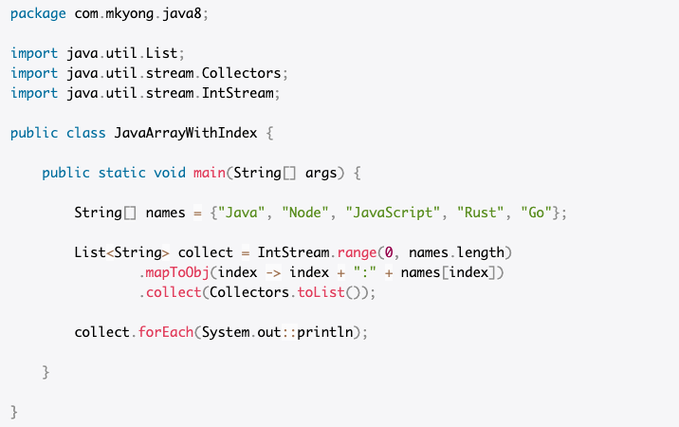

= Measuring print loops
:icons: font
ifdef::env-github[]
:tip-caption: :bulb:
:note-caption: :information_source:
:important-caption: :heavy_exclamation_mark:
:caution-caption: :fire:
:warning-caption: :warning:
endif::[]

On February 23rd, 2020, the Twitter account https://twitter.com/java:[@java] tweeted out the following:

[quote, @java on Twitter, https://twitter.com/java/status/1231443603102294019]
____
A simple tip to print the Array or List with index in the front. #Java

http://oracl.info/xu1B50ypCAU

____
While this does of course work, it may not be the best solution (both in terms of readability and in terms of performance).

Other suggestions made in the replies were:

.Suggestion by https://twitter.com/colmaclean::[Colin MacLean] in https://twitter.com/colmaclean/status/1231486166173614080:[this tweet]
[source, java]
----
int i = 0;
for (String name : names) {
   System.out.println(i++ + “: “ + name);
}
----
and

.Suggestion by http://twitter.com/blalasaadri:[me] in https://twitter.com/blalasaadri/status/1231512531786752000:[this tweet]
[source, java]
----
for (int i=0; i < names.length; i++) {
  System.out.println(i + ": " + names[i]);
}
----
Then, https://twitter.com/ReckordCarsten::[Carsten Reckord] https://twitter.com/ReckordCarsten/status/1231523609954455552:[suggested], that someone writes a microbenchmark to compare the three options.
This is that microbenchmark suite.

[NOTE]
====
[#additonal-stream-solution]
I decided to add one further alternative, which uses streams and may be more comparable to the other two solutions:

[source, java]
----
include::src/main/java/com/github/blalasaadri/MyBenchmark.java[tag=streams_in_one_go, indent=0]
----
The original stream solution looped through the names twice (once when mapping them and once when printing them).
This solution only goes through them once (since `forEach` is the only https://docs.oracle.com/javase/8/docs/api/java/util/stream/package-summary.html#StreamOps[terminal stream operation], whereas in the original solution there was also `collect`.)

This alternative is not contained in the original measurements below - in part because I only thought of this problem after I had already started measuring and in part because every new benchmark increases the runtime considerably.
I will add the results for this new benchmark in separate gists.
====

== Implementation

This microbenchmark suite uses https://openjdk.java.net/projects/code-tools/jmh/[JMH], a "`Java harness for building, running, and analysing nano/micro/milli/macro benchmarks written in Java and other languages targetting the JVM.`" footnote:[The article https://www.oracle.com/technical-resources/articles/java/architect-benchmarking.html:[Avoiding Benchmarking Pitfalls on the JVM] from July 2014 may be old, but it explains why using JMH helps avoid common mistakes when writing microbenchmarks.]

Rather than using `System.out.println(..)` (which will synchronously output the given string to `stdout` by default), I decided to use an instance of https://javadoc.io/doc/org.openjdk.jmh/jmh-core/1.23/org/openjdk/jmh/infra/Blackhole.html#consume-java.lang.Object-:[`Blackhole#consume(Object)`] instead.
This will prevent https://en.wikipedia.org/wiki/Dead_code_elimination:[dead-code elimination] by the runtime.
The `blackhole` objects in the following code are instances of `Blackhole`.

With that, we have three implementations:

1. The original suggestion using Streams
+
[source, java]
----
ifdef::env-github[]
List<String> collect = IntStream.range(0, names.length)
        .mapToObj(index -> index + ": " + names[index])
        .collect(Collectors.toList());

collect.forEach(blackhole::consume);
endif::[]
ifndef::env-github[]
include::src/main/java/com/github/blalasaadri/MyBenchmark.java[tag=streams, indent=0]
endif::[]
----
2. The suggestion by Coling MacLean using an enhanced for loop
+
[source, java]
----
ifdef::env-github[]
int i = 0;
for (String name : names) {
    blackhole.consume(i++ + ": " + name);
}
endif::[]
ifndef::env-github[]
include::src/main/java/com/github/blalasaadri/MyBenchmark.java[tag=enhanced_for, indent=0]
endif::[]
----
3. My suggestion using a basic for loop with an index
+
[source, java]
----
ifdef::env-github[]
for (int i = 0; i < names.length; i++) {
            blackhole.consume(i + ": " + names[i]);
        }
endif::[]
ifndef::env-github[]
include::src/main/java/com/github/blalasaadri/MyBenchmark.java[tag=old_school_for, indent=0]
endif::[]
----

== Running these benchmarks

The benchmarks can be compiled with Maven:
[source, console]
----
$ ./mvnw clean package
----
The project is built to run with Java 13, though it should work fine with Java 8 or later.
To change the Java version, modify the `java.version` property in the `pom.xml`:
[source, xml]
----
<properties>
ifdef::env-github[]
    <!--
        Java version to use for compilation.
        Possible values: 8, 9, 10, 11, 12, 13,...
      -->
    <java.version>13</java.version>
endif::[]
ifndef::env-github[]
include::pom.xml[tag=java_version, , indent=4]
endif::[]
<properties>
----
Or via the command line:
[source, console]
----
$ ./mvnw clean package -Djava.version=8
----

The benchmarks can then be run with:
[source, console]
----
$ java -jar target/benchmarks.java
----

[WARNING]
====
Running these benchmarks takes a long time.
The total completion time for one call for me (with the original 3 benchmarks) was about 50 minutes.
Having added a fourth benchmark (as described <<additonal-stream-solution, here>>) the time is even longer.
====

== Measurements

I ran all benchmarks with multiple Java versions.
There are two variants (which is what the `listVariant` output refers to):

FIVE_NAMES::
    The original five names from the tweet: `{"Java", "Node", "JavaScript", "Rust", "Go"}`
AUTO_GENERATED_NAMES::
    Normally, you wouldn't run this kind of algorithm on just 5 names.
    So, to make the whole thing a bit more realistic, I had the benchmark generate 1000 names:
+
[source, java]
----
include::src/main/java/com/github/blalasaadri/MyBenchmark.java[tag=autogenerate_names, indent=0]
----
This name generation occurs within a function annotated with https://javadoc.io/doc/org.openjdk.jmh/jmh-core/latest/org/openjdk/jmh/annotations/Setup.html:[`@Setup(Leve.Trial)`].
This means, that the array is generated before each trial and this generation will _not_ be included in the measurement itself.

=== With Java 8

.Java version information for Java 8
[source, console]
----
$ java -version
openjdk version "1.8.0_242"
OpenJDK Runtime Environment (build 1.8.0_242-8u242-b08-0ubuntu3~19.10-b08)
OpenJDK 64-Bit Server VM (build 25.242-b08, mixed mode)
----

.Benchmark results
[source]
----
Benchmark                                   (listVariant)   Mode  Cnt         Score        Error  Units
MyBenchmark.mapAndPrintWithStreams             FIVE_NAMES  thrpt   25   5207121,355 ± 276740,844  ops/s
MyBenchmark.mapAndPrintWithStreams   AUTO_GENERATED_NAMES  thrpt   25     27035,503 ±   2851,299  ops/s
MyBenchmark.printInEnhancedForLoop             FIVE_NAMES  thrpt   25  10380706,822 ± 786963,780  ops/s
MyBenchmark.printInEnhancedForLoop   AUTO_GENERATED_NAMES  thrpt   25     38088,946 ±    348,914  ops/s
MyBenchmark.printInOldSchoolForLoop            FIVE_NAMES  thrpt   25  10453896,992 ± 796088,166  ops/s
MyBenchmark.printInOldSchoolForLoop  AUTO_GENERATED_NAMES  thrpt   25     38599,330 ±    358,688  ops/s
----
For the original, shorter list, both for loops had about twice the throughput compared to the stream.
With the much longer array of names, the enhanced for loop clocked in at about 1.41 times the throughput of the stream solution basic for loop managed about 1.43 times the throughput.

The complete output can be found in https://gist.github.com/blalasaadri/f9c6de09275438f4f3817e3e3a773d20:[this gist].

== With Java 11
.Java version information for Java 11
[source, console]
----
$ java -version
openjdk version "11.0.6" 2020-01-14
OpenJDK Runtime Environment (build 11.0.6+10-post-Ubuntu-1ubuntu119.10.1)
OpenJDK 64-Bit Server VM (build 11.0.6+10-post-Ubuntu-1ubuntu119.10.1, mixed mode, sharing)
----

.Benchmark results
[source]
----
Benchmark                                   (listVariant)   Mode  Cnt        Score         Error  Units
MyBenchmark.mapAndPrintWithStreams             FIVE_NAMES  thrpt   25  4296358,352 ±  545014,011  ops/s
MyBenchmark.mapAndPrintWithStreams   AUTO_GENERATED_NAMES  thrpt   25    26803,661 ±    3479,115  ops/s
MyBenchmark.printInEnhancedForLoop             FIVE_NAMES  thrpt   25  9348700,863 ± 1023949,109  ops/s
MyBenchmark.printInEnhancedForLoop   AUTO_GENERATED_NAMES  thrpt   25    37878,684 ±    3026,570  ops/s
MyBenchmark.printInOldSchoolForLoop            FIVE_NAMES  thrpt   25  9819339,718 ± 1230652,392  ops/s
MyBenchmark.printInOldSchoolForLoop  AUTO_GENERATED_NAMES  thrpt   25    39678,611 ±    3593,970  ops/s
----
For the original, shorter list, the enhanced for loop had about 2.18 the throughput compared to the stream while the basic for loop had about 2.29 times the throughput.
With the much longer array of names, the enhanced for loop clocked in at about 1.41 times the throughput of the stream solution basic for loop managed about 1.48 times the throughput.

The complete output can be found in https://gist.github.com/blalasaadri/d0b05f422cba32b71450c8f2b73a577c:[this gist].

=== With Java 13

.Java version information for Java 13
[source, console]
----
$ java -version
openjdk version "13.0.1" 2019-10-15
OpenJDK Runtime Environment AdoptOpenJDK (build 13.0.1+9)
OpenJDK 64-Bit Server VM AdoptOpenJDK (build 13.0.1+9, mixed mode, sharing)
----

.Benchmark results
[source]
----
Benchmark                                   (listVariant)   Mode  Cnt        Score        Error  Units
MyBenchmark.mapAndPrintWithStreams             FIVE_NAMES  thrpt   25  5355473,456 ± 527496,942  ops/s
MyBenchmark.mapAndPrintWithStreams   AUTO_GENERATED_NAMES  thrpt   25    26485,990 ±   2196,793  ops/s
MyBenchmark.printInEnhancedForLoop             FIVE_NAMES  thrpt   25  8839903,376 ± 991895,966  ops/s
MyBenchmark.printInEnhancedForLoop   AUTO_GENERATED_NAMES  thrpt   25    35993,876 ±   2339,770  ops/s
MyBenchmark.printInOldSchoolForLoop            FIVE_NAMES  thrpt   25  9110027,753 ± 678835,086  ops/s
MyBenchmark.printInOldSchoolForLoop  AUTO_GENERATED_NAMES  thrpt   25    35559,584 ±   2999,247  ops/s
----
For the original, shorter list, the enhanced for loop had about 1.65 the throughput compared to the stream while the basic for loop had about 1.70 times the throughput.
With the much longer array of names, the enhanced for loop clocked in at about 1.36 times the throughput of the stream solution basic for loop managed about 1.34 times the throughput.

The complete output can be found in https://gist.github.com/blalasaadri/3841ae12bde7e6f32dc02c41fc375ebe:[this gist].

//=== With Java 14 (early access)
//
//.Java version information for Java 14 (early access)
//[source, console]
//----
//$ java -version
//openjdk version "14-ea" 2020-03-17
//OpenJDK Runtime Environment (build 14-ea+27-1339)
//OpenJDK 64-Bit Server VM (build 14-ea+27-1339, mixed mode, sharing)
//----
//
//.Benchmark results
//[source]
//----
//----

=== Conclusions from those measurements
Both for loops were considerably faster than the stream solution suggested in the original tweet (about twice the throughput for the short list and about 1.4 times the throughput for the much longer list).
In both cases, the enhanced for loop was slightly better than the basic for loop.

The exact measurements may vary depending on a number of factors, including but not limited to:

- the hardware used to run the benchmarks
- the Java version used to run the benchmarks
- other processes running at the same time as the benchmarks

The finding, that both for loops are faster than the solution using streams however is very likely to hold up, even taking those considerations into account.

== Other considerations

One major point to be considered when writing code is the readability of this code - ideally, code should be easy to understand.
Or, to quote Martin Fowler:

[quote, Martin Fowler, "Refactoring: Improving the Design of Existing Code, 1999, p. 15"]
____
Any fool can write code that a computer can understand. Good programmers write code that humans can understand.
____

This microbenchmark suite can not (and does not try to) measure readability, in part because this is subjective.
However, here are my thoughts on the three implementations.

.The original suggestion using Streams
[source, java]
----
ifdef::env-github[]
List<String> collect = IntStream.range(0, names.length)
        .mapToObj(index -> index + ": " + names[index])
        .collect(Collectors.toList());

collect.forEach(blackhole::consume);
endif::[]
ifndef::env-github[]
include::src/main/java/com/github/blalasaadri/MyBenchmark.java[tag=streams, indent=0]
endif::[]
----

This has a total of 4 lines of code (not counting the empty line).
To understand what it's doing, you have to understand how the stream is created, which and how many elements are contained in that stream, how the mapping works and how the collection works.

.The suggestion by Coling MacLean using an enhanced for loop
[source, java]
----
ifdef::env-github[]
int i = 0;
for (String name : names) {
    blackhole.consume(i++ + ": " + name);
}
endif::[]
ifndef::env-github[]
include::src/main/java/com/github/blalasaadri/MyBenchmark.java[tag=enhanced_for, indent=0]
endif::[]
----

This also has a total of 4 lines of code.
To understand what it's doing, you have to understand how an https://docs.oracle.com/javase/specs/jls/se7/html/jls-14.html#jls-14.14.2:[enhanced for loop]footnote:[also sometimes called a _for each loop_] works and when the index is incremented for `i++`.

.My suggestion using a basic for loop with an index
[source, java]
----
ifdef::env-github[]
for (int i = 0; i < names.length; i++) {
            blackhole.consume(i + ": " + names[i]);
        }
endif::[]
ifndef::env-github[]
include::src/main/java/com/github/blalasaadri/MyBenchmark.java[tag=old_school_for, indent=0]
endif::[]
----

This has a total of 3 lines of code.
To understand what it's doing, you have to understand how a https://docs.oracle.com/javase/specs/jls/se7/html/jls-14.html#jls-14.14.1:[basic for loop] works and when the index is incremented for `i++`.

I am of the opinion (and you may disagree on this), that the basic for loop is the best choice here for the following reasons:

- it has the fewest lines of code while still being easy to understand
- it requires only very basic knowledge of the Java language and no APIs (such as the Stream API)
- it makes explicit use of the index `i`, not only to retrieve the item from the array but also to be part of the result